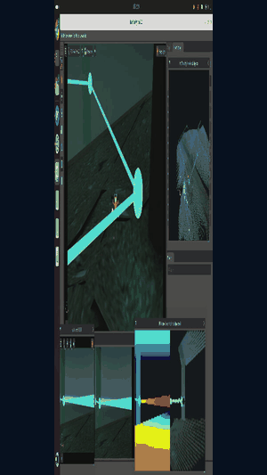
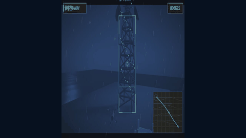

<div align="center">
  

  # Nezha Simulator

  Gazebo / ROS simulation for the **Nezha** family of *transmedia* robots —
  vehicles that operate across air, water surface, and underwater (and, for the
  Husky platform, on land). Includes the cross-medium hydrodynamics, buoyancy,
  wave-field and transmedia propeller models that make air ⇄ water transitions
  physically plausible.
</div>

---

## NezhaSim2 — the next generation

NezhaSim2 carries the transmedium work forward with one deterministic C++
physics core shared by headless, ROS 2/Gazebo Harmonic, MuJoCo, and NVIDIA Isaac
Sim backends. It adds decomposed force reporting, PX4 integration, mission
tooling, and underwater perception/reconstruction workflows.

<p align="center">
  
  &nbsp;
  
</p>

> NezhaSim2 is under active development. This package is the ROS 1 / Gazebo 11
> NezhaSim implementation.

## Contents

| Package | What's inside |
|---|---|
| [`nezha_description`](nezha_description/) | URDF/Xacro robot models, meshes, and the shared Xacro macro library. See its [README](nezha_description/README.md) for the model convention. |
| [`nezha_gazebo`](nezha_gazebo/) | Gazebo worlds, models, launch files, and control/utility scripts. |
| [`nezha_plugins`](nezha_plugins/) | C++ Gazebo plugins: hydrodynamics, buoyancy, wave field, transmedia drag, motor model, MAVLink bridge. |

## Requirements

- **Ubuntu 20.04** + **ROS Noetic**
- **Gazebo 11** (`gazebo_ros`)
- Build tools: `catkin_tools` (`catkin build`) and `rosdep`

## Build

This workspace provides three Nezha ROS packages plus pinned upstream
dependencies under `third_party/`. The ROS Noetic UUV port is vendored because
it contains compatibility changes; the remaining repositories are Git
submodules. Their exact revisions are also recorded in [`nezha.repos`](nezha.repos).

```bash
# 1. Clone the catkin workspace and pinned dependencies
git clone --recurse-submodules \
  https://github.com/panzerjagerWang/NezhaSim-An-All-Domain-Simulator.git ~/nezha_ws

# 2. Resolve system deps and build
cd ~/nezha_ws
rosdep install --from-paths src --ignore-src -r -y
catkin build
source devel/setup.bash
```

## Quick start

```bash
# Transmedia quadrotor in a lake (scene starts paused)
roslaunch nezha_gazebo nezha_mini_lake.launch

# Nezha-F transmedia vehicle
roslaunch nezha_gazebo nezha_f.launch
roslaunch nezha_gazebo nezha_f_hitl.launch     # hardware-in-the-loop (PX4 / MAVLink)

# Husky multi-domain (ground + air + underwater)
roslaunch nezha_gazebo nezha_husky.launch
roslaunch nezha_gazebo nezha_husky_UGV_UAV_UUV.launch

# RexROV ROV with spotlight in a lake
roslaunch nezha_gazebo rexrov_lake.launch

# Open-ocean world with waves
roslaunch nezha_gazebo ocean_world.launch
```

> Launch files are grouped under `nezha_gazebo/launch/` (with `nezha_husky/`,
> `nezha_mini_lake/`, and `spotlight/` subfolders for the multi-launch setups).

## Tutorials

New to NezhaSim? Work through the beginner tutorials in
[`docs/tutorials/`](docs/tutorials/) — a guided path from your first launch to
hardware-in-the-loop:

1. [Getting started](docs/tutorials/01-getting-started.md) — first launch, Gazebo, the ROS graph
2. [Worlds & robots](docs/tutorials/02-worlds-and-robots.md) — picking a robot and a world
3. [Transmedium take-off](docs/tutorials/03-transmedium-takeoff.md) — command an air ⇄ water transition
4. [Triple-domain Husky](docs/tutorials/04-triple-domain-husky.md) — inspect the staged land/air/underwater model
5. [Underwater control](docs/tutorials/05-underwater-control.md) — discover and command thrusters
6. [Inspecting forces](docs/tutorials/06-inspecting-forces.md) — use the actual force and phase interfaces
7. [Hardware-in-the-loop](docs/tutorials/07-hardware-in-the-loop.md) — *(advanced)* drive a real PX4 FC

## Robots

| Model | Domain(s) | Notes |
|---|---|---|
| `nezha_mini` | air + underwater | Transmedia quadrotor. **Reference model** for the Xacro convention. |
| `nezha_mini_cam` | air + underwater | `nezha_mini` with an onboard camera. |
| `nezha_f` / `nezha_f_mav` | air + underwater | Nezha-F vehicle; `_mav` adds the PX4/MAVLink interface. |
| `nezha_husky` / `nezha_husky1` | ground + air + underwater | Husky UGV carrying UAV and UUV payloads. |
| `nezha_rocket` | air + underwater | Rocket-style transmedia body. |
| `rexrov_spotlight` / `spotlight` | underwater | RexROV ROV with an articulated spotlight. |
| `iris` | air | Stock Iris quad (rotors_simulator reference). |
| `nezha_gantry_distance` / `nezha_gantry_velocity` | test rig | Constrained gantry rigs for force/identification tests. |
| `nezha_beetle` | air + underwater | Experimental (incomplete meshes). |

Shared Xacro lives in `nezha_description/common/` (UAV macros) and
`nezha_description/underwater_components/` (UUV sensor/snippet macros).

## Worlds

`nezha_lake`, `nezha_ocean`, `nezha_empty`, `nezha_empty_underwater`,
`nezha_auv_underwater`, `underwater_heightmap`, `nezha_husky_demo`,
`nezha_herkules_ship_wreck`, `nezha_mangalia`, `nezha_mumbles_head`,
`nezha_munkholmen` — under `nezha_gazebo/worlds/`.

## Plugins

Built by `nezha_plugins` (see [`nezha_plugins/CMakeLists.txt`](nezha_plugins/CMakeLists.txt)):

| Library | Role |
|---|---|
| `nezha_unified_plugin` | Unified buoyancy + drag hydrodynamics pipeline. |
| `nezha_buoyant_object_plugin` | Per-link buoyancy from submerged volume. |
| `nezha_underwater_plugin` | Underwater rigid-body hydrodynamics. |
| `nezha_transmedia_drag_plugin` | Cross-medium (air/water-entry/exit) lift & drag. |
| `nezha_motor_model` | Transmedia propeller / thruster (in-air & in-water CTR). |
| `nezha_surface_plugin` | Free-surface interaction. |
| `nezha_wavefield_plugin` / `nezha_wavefieldmodel_plugin` | Ocean wave field generation. |
| `nezha_wave_probe_plugin` | Wave-height probe sensor. |
| `nezha_phase_switch_plugin` | Air ⇄ water phase detection / switching. |
| `nezha_terrain_detector_plugin` | Ground/terrain contact detection. |
| `nezha_wheel_efficiency_plugin` | UGV wheel efficiency on soft/wet terrain. |
| `nezha_robot_state_plugin` | Robot state publishing. |
| `nezha_mavlink_interface` | PX4 / MAVLink bridge. |

## License & maintainer

Maintainer: **Jiaqing Wang** — `jiaqing.wang@sjtu.edu.cn` (SJTU).
See each package's `package.xml` for its license. Third-party packages listed
in `nezha.repos` retain their own upstream licenses.
